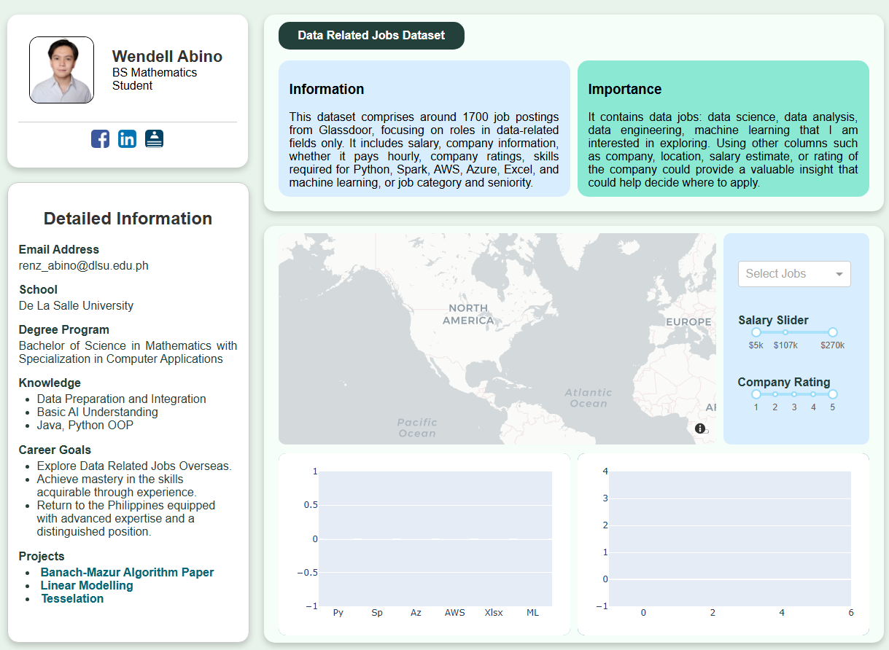
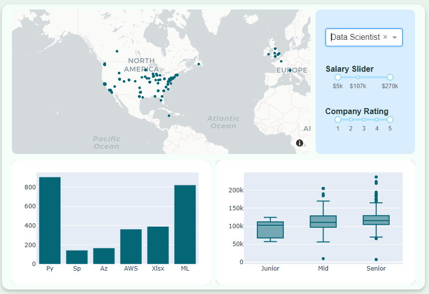

# Personal Dashboard Project

This project was a requirement in my Data Analysis and Visualization class, focusing on how to create a dashboard primarily to show data visualizations, supported by html and CSS design.

Below is a screenshot of my personal dashboard after running the app

---

    

---

And this is an effect of selecting something in the dropdown. The graphs vary depending on the user's choice, but as an example of an action, we have

---

    

---

Instructions to run the app: Clone the repository, simply run app.py and click the IP Address that should show up in the terminal section of your IDE.
